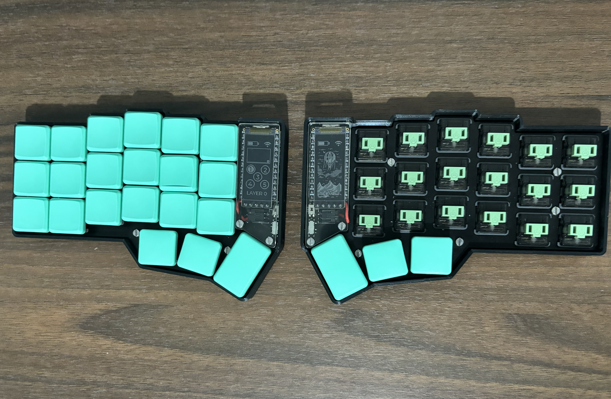
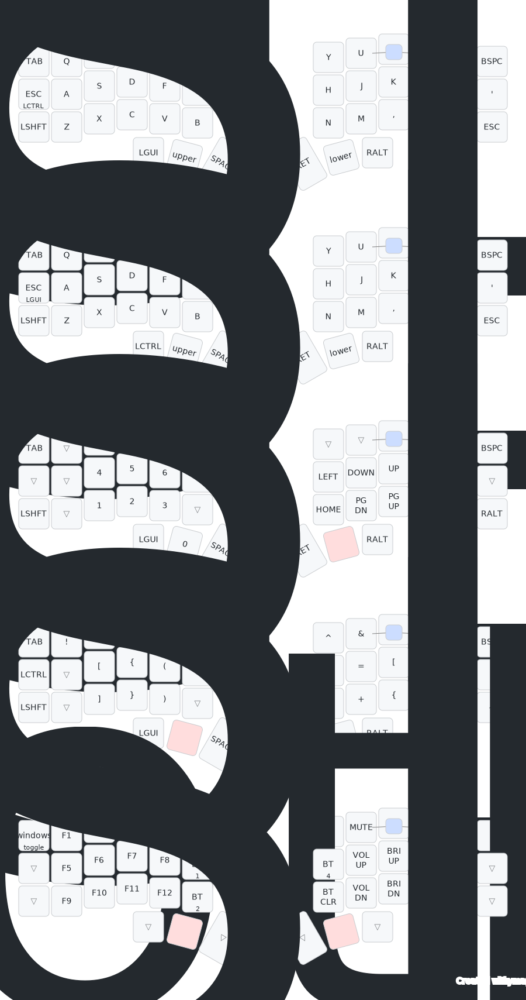

## TODO
- macros 
    -> save nvim
    ~~ -> copy paste ~~
    -> i3wm?
- strengthen bluetooth connection
- make 'layer' + 'Alt' a combo instead of 'nested-in-layer' button
- Update SVG keymap image
- GAMING LAYER??
- Test Home Row Modifiers
- More Chords/Combos
- prtScrn, combos for taking screenshots, swapping monitors
- layer tap to combine enter and layer key on right side (good change for future barstardkeyboard/ferris)

## Keyboards:
### Poor Man's Corne-ish Zen
i dream of owning a corne

### Hand-Wired Dactyl Cygnus

## Keymap

