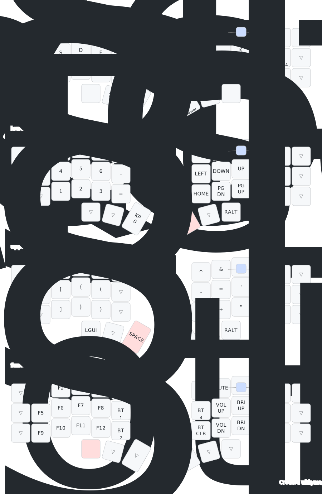

## TODO
- macros (save nvim, i3wm?)
- Update SVG keymap image
- GAMING LAYER??
- Test Home Row Modifiers
- More Chords/Combos
- prtScrn, combos for taking screenshots, swapping monitors
- i3 (when w+e+k pressed. swap to number layer and next key press is alt + number key.
- layer tap to combine enter and layer key on right side (good change for future barstardkeyboard)

## Keyboards:
### Poor Man's Corne-ish Zen

### Hand-Wired Dactyl Cygnus

## Keymap

